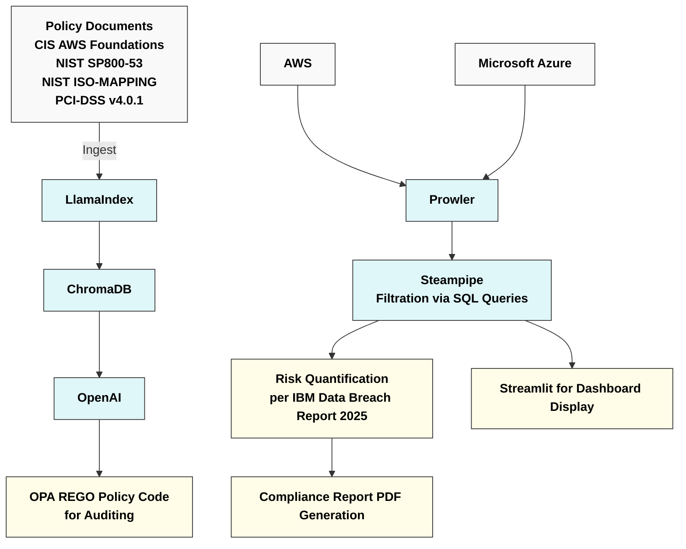

# Multi Cloud GRC (Governance,Risk & Compliance) Automation Engine with Remediation using Prowler and Steampipe

This project shows how can we securely build & monitor a multi cloud setup (in this case : Data migration setup between AWS and Azure) by continuously scanning with tools like prowler,creating a remediation code using AI agents like openAI with training sets from prowler findings and compliance documents set (like PCI-DSS,NIST AWS,CISS) stored in vector database like chromaDB while being audited by OPA REGO policy, filtering critical and imporant events using steampipe SQL based queries,creating a risk quantification based report and creating a dashboard using streamlit for data visualization.

If you want to view a detailed technical report you can view 
**For one time deployment , you can either run github actions workflow file (configured using your secrets) or run this website**

Think of this project as a auto-regulator who scans any cloud resource for any compliance issues and generate findings,if issues/irregularities are found then first it will provide auto remediation code based on Compliance report trainingset , extracts critical data from findings and provides quantification reports and dashboard for visualization and auditing

**Step by Step Process (Layman's View):**
*Like driving a car: Traffic police scan for violations (e.g., speeding). If found, they record a report and issue a fine to enforce rules.*

1) Build a sample cloud configuration - create a sample cloud configuration (in this case multi cloud data transfer setup between aws and azure)
2) Perform a prowler scan - Using tools like Prowler either by GUI/command line . You can perform live cloud configurations scans filtered by regions,service accounts etc to extract findings
3) Develop a Database - Create a database efficient for retrieval (like vector DB that stores data in form of geometric points) that consists of data of compliance regulation documents like PCI-DSS,CISS,NIST and more
4) Provide Remediation Code - Based on prowler findings and Database , prompt OpenAI for remediation code
5) Create OPA REGO Custom policy code - create a policy code that will check the remediation code provided by OpenAI (like traffic police) to check for any discripencies
6) Filter critical findings using Steampipe - Using steampipe based SQL queries, filter only important/critical findings from prowler findings
7) Calculate & prepare risk quantification report - Based on filtered queries , calculate & prepare the risk quantification report based on IBM data breach report 2025 metrics
8) Create streamlit visualization display - Create a data visualization web page for visualizing/analyzing risk findings via streamlit

