# Multi Cloud GRC (Governance,Risk & Compliance) Automation Engine with Remediation using Prowler and Steampipe

This project shows the demonstration of compliance scan of a multi cloud scenario of aws and azure . 

```mermaid
graph TD
    A[Policy Documents<br>CIS AWS Foundations<br>NIST SP800-53<br>NIST ISO-MAPPING<br>PCI-DSS v4.0.1] -->|Ingest| B[LlamaIndex]
    C[AWS] --> D[Prowler]
    E[Microsoft Azure] --> D
    B --> F[ChromaDB]
    F --> G[OpenAI]
    D --> H[Steampipe<br>Filtration via SQL Queries]
    G --> I[OPA REGO Policy Code<br>for Auditing]
    H --> J[Risk Quantification<br>per IBM Data Breach Report 2025]
    J --> K[Compliance Report PDF Generation]
    H --> L[Streamlit for Dashboard Display]

    style A fill:#000000,stroke:#000,stroke-width:3px
style C fill:#000000,stroke:#000,stroke-width:3px
style E fill:#000000,stroke:#000,stroke-width:3px
style B fill:#000000,stroke:#000,stroke-width:3px
style D fill:#000000,stroke:#000,stroke-width:3px
style F fill:#000000,stroke:#000,stroke-width:3px
style G fill:#000000,stroke:#000,stroke-width:3px
style H fill:#000000,stroke:#000,stroke-width:3px
style I fill:#000000,stroke:#000,stroke-width:3px
style J fill:#000000,stroke:#000,stroke-width:3px
style K fill:#000000,stroke:#000,stroke-width:3px
style L fill:#000000,stroke:#000,stroke-width:3px   
```

