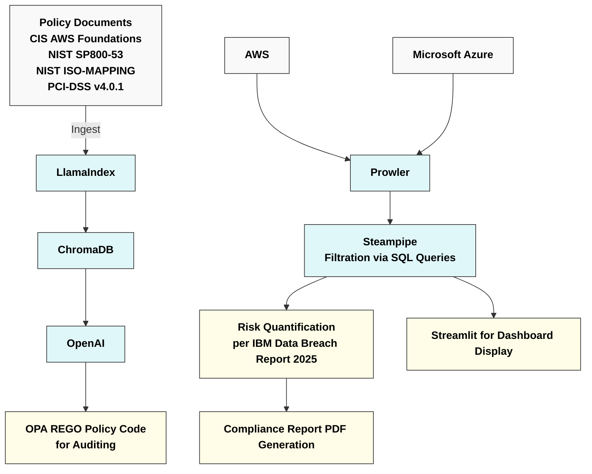

# Multi Cloud GRC (Governance,Risk & Compliance) Automation Engine with Remediation using Prowler and Steampipe

This project shows the demonstration of compliance scan of a multi cloud scenario of Aws and Azure.  

```mermaid
graph LR
    subgraph AWS
        A[AWSC IAM] 
        B[S3 BUCKET<br>AES 256]
        C[AWSC RDS<br>(Relational Database Service)]
        D[AWSC DATASYNC]
        E[AWSC DataSync Agent]
    end

    subgraph Azure
        F[AZURE SERVICE PRINCIPAL]
        G[AZURE KEY VAULT]
        H[AZURE STORAGE ACCOUNT]
        I[AZURE STORAGE CONTAINER]
        J[AZURE DATA FACTORY]
        K[AZURE SQL SERVER]
        L[Direct connection string<br>via user:password]
    end

    B --> D
    C --> D
    D --> E
    E --> J
    F --> G
    G --> H
    H --> I
    I --> J
    J --> K
    L --> K

    style A fill:#f9f9f9,stroke:#333,color:#000,font-weight:bold
    style B fill:#f9f9f9,stroke:#333,color:#000,font-weight:bold
    style C fill:#f9f9f9,stroke:#333,color:#000,font-weight:bold
    style D fill:#e0f7fa,stroke:#333,color:#000,font-weight:bold
    style E fill:#e0f7fa,stroke:#333,color:#000,font-weight:bold
    style F fill:#fffde7,stroke:#333,color:#000,font-weight:bold
    style G fill:#fffde7,stroke:#333,color:#000,font-weight:bold
    style H fill:#e0f7fa,stroke:#333,color:#000,font-weight:bold
    style I fill:#e0f7fa,stroke:#333,color:#000,font-weight:bold
    style J fill:#e0f7fa,stroke:#333,color:#000,font-weight:bold
    style K fill:#f9f9f9,stroke:#333,color:#000,font-weight:bold
    style L fill:#ffcdd2,stroke:#333,color:#000,font-weight:bold

    classDef aws fill:#f9f9f9,stroke:#333;
    classDef azureStorage fill:#e0f7fa,stroke:#333;
    classDef azureSecurity fill:#fffde7,stroke:#333;
    classDef azureSQL fill:#f9f9f9,stroke:#333;
    classDef warning fill:#ffcdd2,stroke:#333;

    class A,B,C aws
    class H,I,J azureStorage
    class F,G azureSecurity
    class K azureSQL
    class L warning   
```



